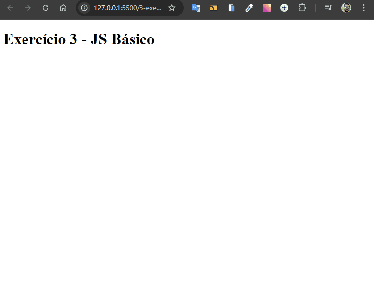

# Popup de Confirmação

Desenvolvido como exercício de JavaScript básico do curso de extensão universitária do DevQuest - Dev em Dobro.

Tratasse de uma implementação de um popup de confirmação utilizando HTML e JavaScript. O objetivo do projeto é permitir que o usuário visualize uma mensagem de confirmação em uma interface limpa e interativa, utilizando a funcionalidade de popups com mensagem diferente de acordo com a escolha.



## Tecnologias Utilizadas

- **HTML**
- **JavaScript**

## Como Usar

1. Clone este repositório:

   ```bash
   git clone https://github.com/Alberesbass/popup-de-confirmacao.git
   ```

2. Abra o arquivo `index.html` em seu navegador para testar a funcionalidade do popup de confirmação.

## Licença

Este projeto está sob a licença MIT. Consulte o arquivo [LICENSE](./LICENSE) para mais informações.

---

Desenvolvido por [Alberes](https://github.com/Alberesbass)